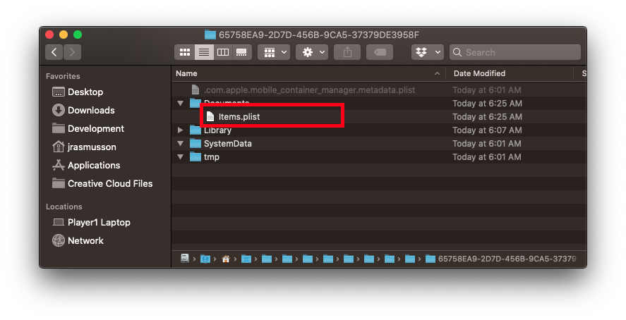

# NSCoder

A way of encoding custom objects to be stored on disk. Same tech used for JSON encoding. To be `Encodable` means you only contain standard object types (strings, floats, ints etc).

## Example

```swift
import UIKit

struct Item: Codable {
    let name: String
}

class ViewController: UIViewController {

        let items = [Item(name: "Kevin"), Item(name: "Sam")]
        
        // Create your own plist file entry. Stored in the documents dir.
        // .../Documents/Items.plist
        guard let dataFilePath = FileManager.default.urls(for: .documentDirectory, in: .userDomainMask).first?.appendingPathComponent("Items.plist") else { return }
        print(dataFilePath)
        
        // Encode
        let encoder = PropertyListEncoder()
        let data = try? encoder.encode(items)
        try? data?.write(to: dataFilePath)
        
        // Decode
        guard let data2 = try? Data(contentsOf: dataFilePath) else { return }
        let decoder = PropertyListDecoder()
        let newItems = try? decoder.decode([Item].self, from: data2)
        print(newItems)
}
```




### Links that help
* [Apple Docs](https://developer.apple.com/documentation/foundation/nscoder)
